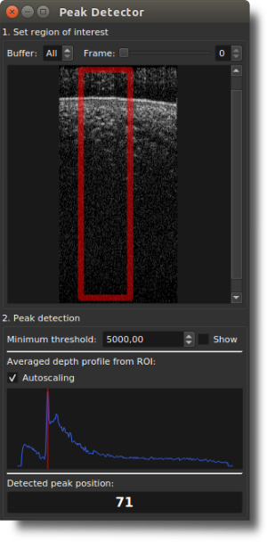

# Peak Detector Extension

The Peak Detector displays the depth position of the highest intensity value within an averaged A-scan. The averaged A-scan is generated by averaging all A-scans within a user-defined Region of Interest (ROI) inside the current B-scan.

This extension can be useful for simple distance measurement tasks or as a starting point for implementing a more advanced OCT peak detection plugin.

<figure markdown="span">
	
	<figcaption>Peak Detector Extension Interface</figcaption>
</figure>

## User interface
| Parameter | Description |
|-----------|-------------|
| Buffer |  The buffer number from which you want to grab the frame. If you only use one buffer per volume, or if it does not matter which specific frame is used for the estimation, select All. This will grab the frame from the next available buffer. |
| Frame | The frame number within the buffer. Together with the buffer number, this allows you to select the specific frame within the OCT volume that should be grabbed. If you only use one frame per buffer, or if it does not matter which specific frame is used for the estimation, select 0. |
| Minimum threshold | Minimum A-scan intensity value that a sample must exceed to be considered a possible peak. |
| Show | If enabled, the position of the minimum threshold is shown in the A-scan plot below as a horizontal line. |
| Autoscaling | If enabled, the A-scan plot is automatically scaled so that the entire A-scan is visible. |
